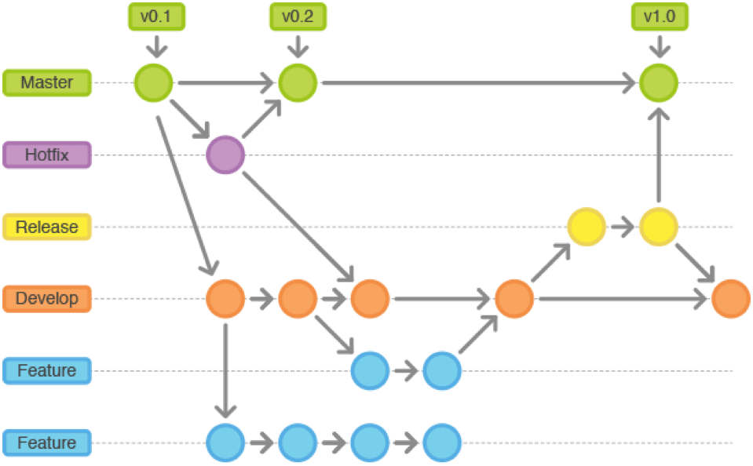
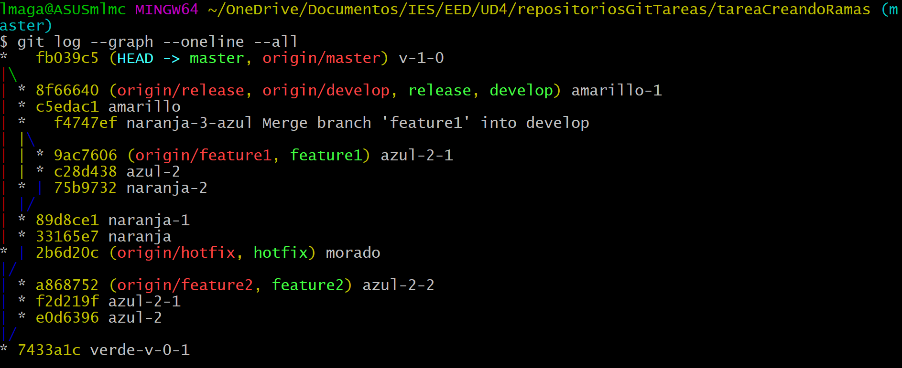
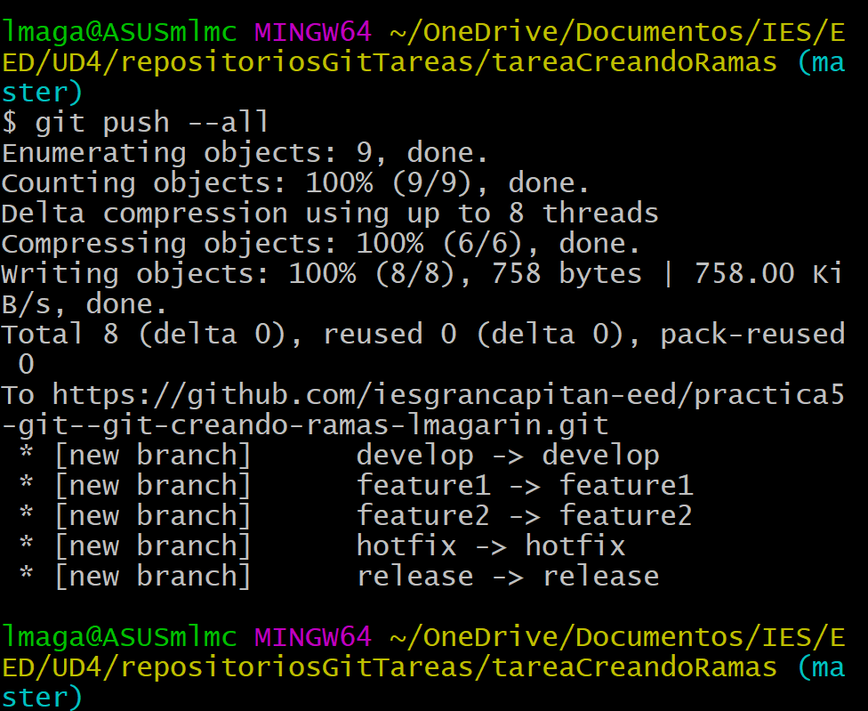
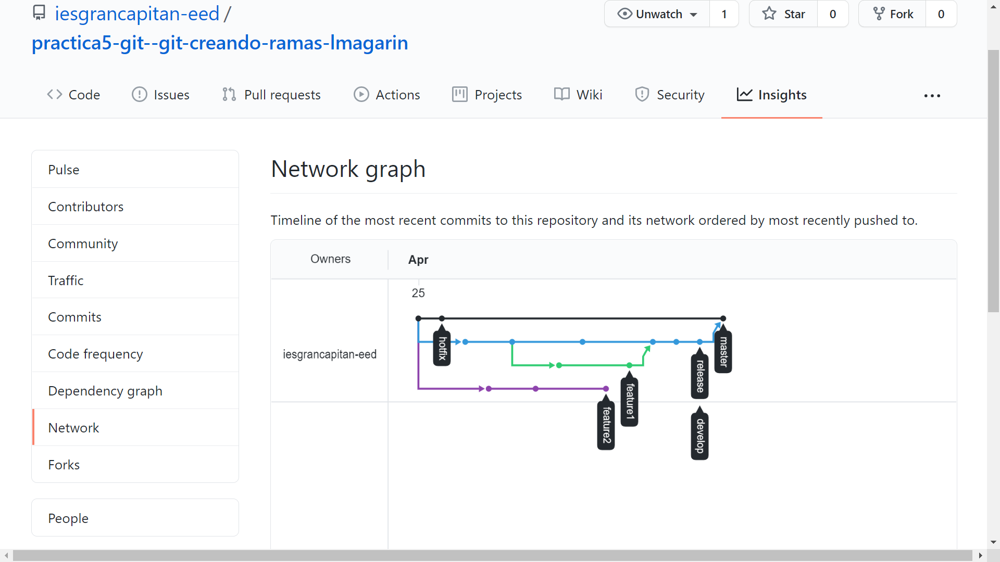

# Practica5. Git. Creando ramas

En esta práctica vas a crear y configurar nuevas ramas, las mezclarás (Merge) y realizarás commits sobre ellas. Para ello usarás el flujo de trabajo GitFlow.

GitFlow fue publicado por primera vez y popularizado por [Vincent Driessen en nvie](https://nvie.com/posts/a-successful-git-branching-model/). El flujo de trabajo de Gitflow define un modelo estricto de ramificación diseñado alrededor de la publicación del proyecto. Proporciona un marco sólido para gestionar proyectos más grandes.

Crea en este repositorio el esquema de ramas que se adjunta:

1. Las ramas utilizadas son:
- Ramas de desarrollo y maestra (develop, master, main)
- Ramas de función (feature)
- Ramas de publicación (release)
- Ramas de corrección (hotfix)
2. El flujo general de Gitflow es el siguiente:
- Se crea una rama de desarrollo a partir de la maestra.
- Una rama de publicación se crea a partir de la de desarrollo.
- Las ramas de función se crean a partir de la de desarrollo.
- Cuando una función está completa, se fusiona en la rama de desarrollo.
- Cuando la rama de publicación está lista, se fusiona en la de desarrollo y la maestra.
- Si se detecta una incidencia en la maestra, se crea una rama de corrección a partir de la maestra.
- Una vez que la corrección está completa, se fusiona tanto con la de desarrollo como con la maestra.
3. Adjunta un pantallazo del comando git log --oneline --decorate --graph --all

4. Una vez subido el repositorio CON TODAS SUS RAMAS, adjunta un pantallazo del apartado de GitHub "Insights"/"Network graph" 

De interés:

- [integracion-continua-de-software-git-y-git-flow](https://castor.com.co/integracion-continua-de-software-git-y-git-flow/)

- [gitflow-workflow](https://www.atlassian.com/es/git/tutorials/comparing-workflows/gitflow-workflow)